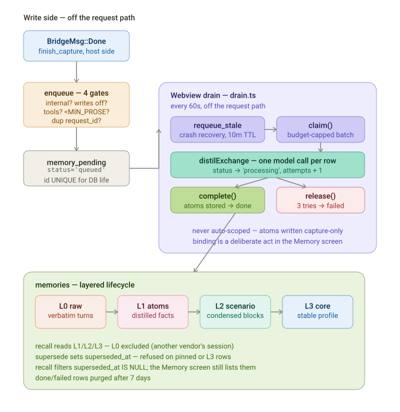

# Memory · Context · Gateway — as-built integration reference

**What this is.** The *runtime* story of how the local gateway, the context layer, and the memory
layer meet. `GATEWAY_MEMORY_LAYER.md` is the design; this is what the code actually does, with file
paths and line numbers for every claim.

**Scope.** One gateway request end to end, the read path, the write path, and the seams between them.
Where this doc and the code disagree, the code wins — cite the line.

**Last verified:** 2026-09-21 against the working tree (post Phase 2 memory headers).

**Diagrams:**

| Diagram | File |
|---------|------|
| Read path — auth → context + memory → upstream → response | [`diagrams/memory-context-gateway-read-path.svg`](../diagrams/memory-context-gateway-read-path.svg) |
| Write path — capture → queue → drain → L0–L3 lifecycle | [`diagrams/memory-context-gateway-write-path.svg`](../diagrams/memory-context-gateway-write-path.svg) |

---

## 0. The one-paragraph version

A request hits one of five ingress handlers on the loopback gateway. Auth runs first and gates
everything. Then a single function — `inject_context` — reads *two independent stores* (BM25 memory
atoms, and recent session turns), composes them into one system block, and prepends it at index 0
under a hard 15 ms deadline. Capture is prepared before dispatch and queued only when the model
finishes, and the queue is drained by the *webview*, not the host. The response carries the outcome
back on two headers. Memory and context never share a store; they share exactly one function call.

---

## 1. Request pipeline — the exact order


The axum router (`gateway.rs:1616-1622`) has five ingress handlers. The OpenAI one is representative
(`gateway_handlers.rs:22`); the Anthropic, Responses, and Gemini handlers are structurally identical.

| # | Step | Where | Notes |
|---|------|-------|-------|
| 1 | **Auth** | `gateway_handlers.rs:23` → `gateway.rs:1296` | Master key (cached), then every active per-app key, constant-time compared. |
| 2 | **Validate** | `gateway_handlers.rs:26-54` | Rejects `functions`; requires `model`; strips tool fields when the toggle is off. |
| 3 | **Capacity** | `gateway_handlers.rs:56` → `gateway.rs:1211` | 8 concurrent, 32 queued (`gateway.rs:35`). |
| 4 | **Context + memory** | `gateway_handlers.rs:65` → `context_scope.rs:454` | The single injection point. Details in §2. |
| 5 | **Capture prep** | `gateway_handlers.rs:68` → `context_scope.rs:701` | Computed *before* dispatch — see §4.1 for why. |
| 6 | **Dispatch** | `gateway_handlers.rs:69` | `bridge.dispatch(BridgeRequest{…})`. Six-header allowlist. |
| 7 | **Response** | `gateway_handlers.rs:237` | `finish_capture` on `Done`, then `apply_memory_headers`. |

### 1.1 Auth accepts three dialects

`presented_key` (`gateway.rs:1241`) reads, in order: `Authorization: Bearer …`, then `x-api-key`
(Anthropic clients), then `x-goog-api-key` (Gemini clients). Gemini additionally supports `?key=`,
handled in its own handler.

`check_gateway_key` (`gateway.rs:1296`) refuses with `503` when the gateway is disabled, `401` when no
master key is configured. Brute-force backoff is applied **on the failure path only**
(`gateway.rs:1272`) — it used to run up front, which meant one bad credential throttled every caller
on the loopback. With per-app keys that is one misconfigured app locking out all the others.

### 1.2 The forwarded-header allowlist

`forwarded_headers` (`gateway.rs:1506-1514`) forwards exactly six headers upstream:

```
user-agent, x-client-name, x-codex-client, accept, x-api-key, anthropic-version
```

**No `AIP-*` header ever reaches a provider.** This is load-bearing: the memory contract is read
host-side only, and `x-api-key` is forwarded because some upstreams re-authenticate on it.

---

## 2. The injection point — `inject_context`

`inject_context` (`context_scope.rs:454`) is a thin wrapper over `inject_context_deadline`
(`:466`) with `MEMORY_DEADLINE`. **It must never fail the request** — every error path returns an
`InjectionOutcome`, never a `Result`.

### 2.1 Order of operations

1. **Clock starts** (`:475`) — before the first byte of work, so the deadline covers the whole path
   and not merely the convenient part.
2. **Read contract** — `RequestMeta::parse(headers, src)` (`:481`). `src` is the *original ingress
   body* when the dialect translated it (`Some(&req)`), because `to_chat_body` and siblings rebuild
   the request from scratch and drop unknown fields — a `metadata.aip` written by a Claude Code or
   Gemini client would not survive translation. Reading the canonical body alone would silently
   ignore the body fallback for exactly the header-less clients it exists to serve.
3. **Resolve scope** — `meta.resolve(src, root)` (`:483`) → `user=local;project=…;agent=…`.
4. **Strip** `metadata.aip` (`:486`) so the gateway-invented field is never forwarded.
5. **Gate** — operator precedence, then client preference (§3).
6. **Recall → rank → trim → compose** — memory block (`:586-621`).
7. **Live context** — session turns (`:636` → `:764`).
8. **Prepend** — one system message at index 0 (`:653`).

### 2.2 Three deadline checks

| Check | Line | Guards |
|-------|------|--------|
| `recall` | `:564` | Window lookup, freeze map, BM25 recall |
| `context` | `:633` | Five reads/writes on the same connection — the lock-contention stage |
| `prepend` | `:640` | Last chance before the client's body is mutated |

A miss logs a warning with `stage` and `scope` (`:504-513`) and dispatches **without memory**. This is
why the gateway can never hang on memory: the failure mode is a smaller prompt, not a stalled request.

### 2.3 The block is frozen, not recomputed

`freeze_key` (`:674`) is `{scope}|{session}` — **deliberately not the query**. A block that re-ranks
per request changes bytes at system position 0 on every call, which invalidates the provider's cached
prefix. A freeze hit skips recall entirely (`:580-584`) — the point is byte-identical output, and the
only way to guarantee that is not to recompute it. The cost is staleness inside the TTL: a session
that changes topic keeps the earlier block until it expires.

Empty blocks are **not** frozen (`:618`) — otherwise "nothing to recall" would pin for the whole TTL
and the first atom anyone distilled would stay invisible.

---

## 3. Gating — one switch, two directions

`principal::allows` (`principal.rs:155-174`) is the single authority, consulted identically on the
read path (`context_scope.rs:526`) and the capture path (`:719`).

```
master switch off  →  false, before any row is read          (principal.rs:161)
no row for principal  →  inherit (true)                      (principal.rs:188)
row present  →  that principal is denied
```

**Two identities, either can deny** (`principal.rs:165-173`): the `AIP-Agent` label *and* `key:<id>`
from the presented app key. A single "winner" would be a hole either way — pick the label only and a
client with a denied key escapes by sending a label with no row; pick the key only and a client drops
its label to escape a denial on it. Absence inherits, so an unlisted second identity adds nothing.

**A denied principal is denied in both directions:**

| Direction | Effect | Line |
|-----------|--------|------|
| Read | `SkipReason::PrincipalOff` — nothing injected | `context_scope.rs:544` |
| Write | `writes_allowed = … && operator_allows` — nothing captured | `context_scope.rs:732` |

"Off" means *not quietly learning from you*, not merely *not reminding you*.

---

## 4. Read path — memory and context are separate stores

The core insight: **memory and context never share a store. They meet only in `inject_context`.**

| | **Memory** | **Live context** |
|---|---|---|
| Tables | `memories` + `memories_fts` | `router_sessions`, `session_turns`, `session_state` |
| Access | BM25 via `recall_scoped` | `recent_turns` + `get_state` |
| Layers | L0–L3 | none |
| Composed by | `compose_block` (`:613`) | `compose_context_block` (`:816`) |

Both are appended into one `block` (`:644-645`) and prepended as a single system message.

**The gateway does not write `context_nodes`.** `live_context` writes session tables — deliberately
*not* the graph (`store.rs:697`). The only gateway-side graph writes are tool calls
(`record_gateway_tool_call`, `gateway_cmds.rs:691-727`, node `kind: "skill"`). The graph itself is
built frontend-side: `engine.ts:414-435` creates `memory:<id>` nodes and `message -recalled-> memory`
edges.

### 4.1 Capture is prepared before dispatch

`prepare_capture` (`context_scope.rs:701`) runs at `gateway_handlers.rs:68`, *before*
`bridge.dispatch`. Two reasons, both stated in the code (`context_scope.rs:684-686`):

1. The SSE branches build a `'static` stream and therefore cannot borrow the request body.
2. Preparing first avoids a second clone of what may be a large prompt — only the small
   `PreparedCapture` struct crosses into the stream.

### 4.2 The two recall paths

There are two callers of recall and they differ on **exactly one axis — scope.**

| | Gateway | Assistant screen |
|---|---|---|
| Call | `recall_scoped(store, q, 20, layers, Some(&rscope))` | `recall(&store, &q, limit, layers)` |
| Line | `context_scope.rs:595` | `commands.rs:384-390` |
| Scope | `RecallScope{user, project, agent}` | `None` |
| Predicate | `scope_global = 1` OR explicit project match | **none at all** |
| Sees `Unscoped` rows | **No** | **Yes** |

The scoped predicate is built in `recall_inner` (`memory.rs:482-513`). An unresolvable project
collapses to `AND m.scope_global = 1 AND m.pinned = 1` (`:510`) — a client that cannot identify
itself gets its hard constraints and nothing else. The design note (`memory.rs:429-435`) is explicit
that **absence is not global**: nullable-means-global would be a contamination engine, since the
header-less IDE is the common case.

On the live corpus this is the difference between **0 and 14 rows**. Same database, different
visibility, entirely by scope.

### 4.3 L0 is excluded by default

The gateway hardcodes `layers = ["L1","L2","L3"]` (`context_scope.rs:593`). L0 is verbatim
conversation, so injecting it ships one vendor's session to another. Opting in is deliberate and
per-scope. The frontend's layered recall makes the same choice for the same reason (`engine.ts:359-363`).

---

## 5. Write path — capture → queue → drain → distillation



The write path is **off the request path by construction**. A slow, misconfigured, or offline model
delays learning; it never delays a response.

### 5.1 Enqueue — four gates

`enqueue` (`capture.rs:376`) refuses in this order, every refusal returning `Enqueue::Skipped`:

| Gate | Reason | Line |
|------|--------|------|
| Internal principal | `InternalPrincipal` | `:378` |
| Writes disabled | `WritesDisabled` | `:381` |
| Tool turn | `ToolTurn` | `:385` |
| Too little prose | `NoProse` | `:393` |
| Duplicate `request_id` | `AlreadyQueued` | `:408` |

Both sides of the exchange are scrubbed (`:390-391`) **before** anything is stored. Class and scope
are written here and never updated (`:412`).

### 5.2 Capture ids carry a boot marker

`request_id` (`capture.rs:89`) is `gw-{boot_marker}-{n}` where `boot_marker()` is `{millis:x}-{pid:x}`
(`:95`). Without it, `gw-5` after a restart collided with a prior row and was **silently dropped** —
`memory_pending.request_id` is UNIQUE for the life of the *database*, not the process, and `next_id`
restarts at 1 each launch.

Note the two different strings: the capture id is `gw-{millis}-{pid}-{n}`; the client-visible
completion id is `gw-{n}` / `resp_gw_{n}` (`gateway_handlers.rs:98`). They are not the same id.

### 5.3 The drain tick

`drain.ts` is the consumer half. `startCaptureDrain` (`drain.ts:108`) is started in `App.tsx:39` —
app-scoped, not screen-scoped, because the queue is filled by the app's own chat and a screen-scoped
drain would stop learning whenever Memory was not the visible screen.

| Function | Purpose | Line |
|----------|---------|------|
| `requeue_stale` | Recover rows whose claim died with the webview (10 min TTL) | `capture.rs:548` |
| `claim` | Take a budget-capped batch, mark `processing`, `attempts + 1` | `capture.rs:458` |
| `complete` | Atoms stored → `done` | `capture.rs:520` |
| `release` | Failed → back to `queued`, or `failed` after 3 attempts | `capture.rs:533` |

Interval is 60 s (`drain.ts:52`) — learning is not latency-sensitive. The pass is re-entrancy-safe
(`:68`), and a claim with no budget returns empty **without spending an attempt** (`capture.rs:464-467`),
because claiming and then declining to call would burn the three attempts on calls that were never
going to happen.

### 5.4 Distilled atoms are capture-only

The queue row carries the request's scope, but distilled atoms are written **capture-only**. Binding
them to a scope is a deliberate act in the Memory screen (`drain.ts:15-17`). An agent's traffic
reaching the injected block on its own say-so is precisely what review rejected.

### 5.5 Retention

`done` and `failed` rows are purged after 7 days (`capture.rs:565`). The queue is written once per
request; without a sweep it grows forever.

---

## 6. Layered lifecycle

| Layer | Meaning | Written by |
|-------|---------|-----------|
| L0 | Verbatim conversation | `engine.ts:110-111` |
| L1 | Distilled atoms | `distilExchange` (`engine.ts:222`) |
| L2 | Scenario blocks, every `SCENARIO_EVERY` atoms | `engine.ts:260` |
| L3 | Stable long-term profile | user-authored / promoted |

**Recall order** is abstract-first (`engine.ts:355-365`): L3/L2 get first refusal on half the budget,
L1 takes the remainder. L0 is not recalled on the gateway path at all.

**Supersede.** `superseded_at` (migration 0014) is set by `supersede`, which **refuses a pinned or L3
row**. Superseded rows are excluded from `recall_inner` by `AND m.superseded_at IS NULL`
(`memory.rs:530`), from `session_atoms`, and from `stats.injectable` — but **not** from `list`, so the
Memory screen still shows them and can restore them.

**Recency.** L3 is exempt from the recency band and always scores full (`memory.rs:362-366`). A core
fact is core because the user wrote it.

---

## 7. Response headers

`apply_memory_headers` (`context_scope.rs:430`) attaches two headers to every finished response —
success, error, and SSE alike (`gateway_handlers.rs:169`, `:209`, `:213`, `:237`):

- `AIP-Memory` — compact status: `injected=1;items=7;tokens=412`, or `injected=0;reason=below_floor`.
  `ctx=N` is appended only when live-context turns were injected (`:414-424`).
- `AIP-Memory-Scope` — the resolved scope, `-` for unresolved parts.

The scope is reported **even when nothing was injected** (`:488-492`). That is the whole point: "why
didn't the model know X" is almost always "the scope resolved to something you did not expect", and
that is invisible if the header only appears on success.

An unparseable header value is dropped rather than propagated (`:431-436`) — the response has already
been earned, and telemetry is not worth failing it for.

**Skip reasons** (`context_scope.rs:380-390`): `disabled`, `principal_off`, `client_off`,
`no_project`, `no_candidates`, `below_floor`, `deadline`, `injected`.

---

## 8. Skills are frontend-only — verified

Bodies live in the SQLite `skills` table but **no `gateway*.rs` mentions them**. The only gateway-side
reference is the context-node kind string `"skill"` for tool calls (`gateway_cmds.rs:706-708`), not
skill bodies. Bodies are expanded only in `Assistant.tsx:581-596` and appended to `system` at `:702`:

```
## ${s.name}
${s.description}

${s.body}
```

The gateway is a blind proxy for `system`. Keep it that way.

---

## 9. Gotchas that each cost real time

| Gotcha | Why it bites | Where |
|--------|--------------|-------|
| **`AIP-*` headers dropped** | Scope must be read host-side; never assume a provider saw it | `gateway.rs:1508` |
| **15 ms deadline** | A miss degrades to no memory, never an error — so "no memory" is the *normal* failure mode | `context_scope.rs:50` |
| **Frozen block, query not in key** | Topic changes keep the stale block until TTL expires | `context_scope.rs:674` |
| **Capture id vs completion id** | `gw-{millis}-{pid}-{n}` ≠ `gw-{n}`; different strings for different consumers | `capture.rs:89`, `gateway_handlers.rs:98` |
| **`deny_unknown_fields` on nested payloads** | Serde *ignores* unknown keys by default — `memory_capture_batch` dropped `sessionId` silently for months. A Tauri command arg and a serde field are different boundaries | `memory.rs:141-143` |
| **`supersede` refuses pinned/L3** | An L3 row cannot be superseded; that is deliberate | `memory.rs:953-958` |
| **Live corpus: 0 vs 14 rows** | Scoped gateway recall sees nothing when memories are Unscoped | `memory.rs:482-513` |
| **L0 excluded** | Injecting L0 ships one vendor's session to another | `context_scope.rs:593` |

---

## 10. Open questions — verified by reading, not yet tested

Two interactions that fall out of the code but have no test asserting them. Both are *observations*,
not bug claims: neither has been reproduced at runtime, so treat the consequence as a hypothesis.

### 10.1 The injected block becomes a second system message

`prepend_system_message` (`context_scope.rs:997-1003`) inserts unconditionally:

```rust
ms.insert(0, json!({ "role": "system", "content": block }));
```

It does not check whether the client already sent a `role: "system"` message. So a client that
supplies its own system prompt ends up with **two** system messages, with the injected block *first*.

Whether that is benign depends on the upstream. OpenAI-compatible providers generally concatenate
multiple system messages in order; some stricter providers reject or silently drop the second. This
has not been probed against Agnes or Cline.

Worth deciding: is "injected block precedes the client's own system prompt" the intended precedence?
The gateway is otherwise scrupulous about operator-over-client precedence (§3) — this is the one place
a client's own instruction could be displaced by injected content.

### 10.2 A timed-out request can still seed the freeze cache

`freeze_memory` is called at `context_scope.rs:619`, *before* the `context` deadline check at `:633`
and the `prepend` check at `:640`. Both of those can `return miss(...)`, which discards the composed
block and reports `injected=0;reason=deadline`.

So a request that overruns after recall can populate the freeze cache with a block it never served.
The next request in the same `{scope}|{session}` within the TTL hits that cache (`:580`) and serves it
— subject to passing its own deadline checks.

Is this a problem? Probably not: the work is preserved rather than wasted, which is the freeze's whole
point. But note the interaction with the freeze key, which **excludes the query** (§2.3). A block
recalled for query A can therefore be frozen by a request that timed out, and later served to query B.
That is a sharper version of the staleness the design already accepts — worth confirming it is
intended, because "the cache was seeded by a request that never got an answer" is not an obvious
property from the outside.

---

## 11. Proven — why gateway recall returns 0 rows

**Measured on the live corpus, 2026-09-21.** This section replaces the earlier hypothesis that the two
halves of memory were "mutually exclusive by construction". That framing was wrong. Here is what is
actually true.

### 11.1 The measurement

```
total memories:            55   (41 L0, 12 L1, 2 L3, 0 L2)
superseded:                 0
rows with scope_project set: 0   ← every row is NULL
rows with scope_global = 1:  0   ← no row is marked global
```

Running the actual recall predicates from `memory.rs:482-513`:

| Path | Predicate | Rows |
|------|-----------|------|
| Gateway, resolved project | `scope_global=1 OR (scope_project=? AND …)` | **0** |
| Gateway, unresolved project | `scope_global=1 AND pinned=1` | **0** |
| Assistant, unscoped | *(no scope predicate)* | **14** |

**0 vs 14 is confirmed, and the cause is simpler than expected: not one row in the database is scoped.**

### 11.2 The chain

1. `capture` INSERT (`memory.rs:290-302`) names eight columns and **does not include any scope column**.
   Every atom therefore takes the column defaults: `scope_project = NULL`, `scope_global = 0`.
   The code says so explicitly (`memory.rs:313-315`): *"Born unscoped: capture-only, never injected.
   Scoping is a deliberate act (`assign_scope`), never a default."*
2. `assign_scope` (`memory.rs:741`) is the **only** way a row becomes injectable — confirmed by the
   frontend doc comment at `store.ts:862`.
3. The Memory screen **does expose it**: a `ScopeSelect` per row (`Memory.tsx:605`), wired through
   `doScope` (`:713`) → `assignMemoryScope` (`:719`).
4. The drain deliberately does **not** auto-bind — asserted by `drain.test.ts:142`
   (`expect(assignScope).not.toHaveBeenCalled()`).
5. Therefore every atom stays capture-only until a human scopes it, one row at a time.

### 11.3 What this means

The 0-vs-14 is **not a bug, and not a missing capability.** The binding machinery is complete,
reachable, and tested. It is simply **unused on this machine** — nobody has ever scoped a memory.

The honest statement of the current state: *a fresh install has a fully-built injection pipeline that
injects nothing until someone manually scopes atoms.* The Assistant still recalls fine, because its
path applies no scope predicate.

The UI already knows this: `Memory.tsx:745-750` renders a hint when `stats.injectable !== stats.total`,
tooltipped *"rows that can actually be injected; the rest are capture-only"*.

So the problem is **discoverability and per-atom friction**, not capability. Two consequences worth
separating:

- **The read machinery is field-unexercised.** The deadline stages, the freeze cache, rank/trim/compose
  — all of it runs on every request and has never once produced a non-empty memory block. It is
  unit-tested but has no production mileage. That is the real risk, and it is a *testing* problem.
- **The obvious "fix" remains a trap.** Loosening the scope predicate to admit Unscoped rows would make
  the 0 become 14 immediately — and simultaneously destroy the contamination guarantee the schema
  exists to provide (`store.rs:664-668`). A one-line change with two invisible consequences.

### 11.4 A correction on method

An intermediate search suggested `assignMemoryScope` was called from nowhere but a test. That was
**wrong** — `Memory.tsx:719` calls it. The pattern search missed a file it should have matched. Worth
recording because it is the exact failure mode project memory warns about: verify a "not found" before
believing it, and prefer the Grep tool over shell `grep` for absence claims.

---

## 12. Live verification — the pipeline works

**Run 2026-09-21 against the running gateway on :8800.** This is the first end-to-end exercise of the
memory read path. Every number below came from a real response header.

### 12.1 Baseline — before scoping anything

```
aip-memory: injected=0;reason=no_candidates
aip-memory-scope: user=local;project=ai-provider-router;agent=cursor
```

`reason=no_candidates` — not `below_floor`. That distinction matters: recall returned **zero rows**,
rather than rows that were found but did not fit the budget. The scope resolved correctly even though
nothing was injected, which is the documented purpose of always reporting it.

### 12.2 After scoping three L1 atoms to `ai-provider-router`

```
aip-memory: injected=1;items=3;tokens=96;ctx=1
aip-memory-scope: user=local;project=ai-provider-router;agent=cursor
```

- `items=3` — exactly the three rows scoped.
- `ctx=1` — **one live-context turn injected independently of memory.** The two halves of
  `inject_context` are separately visible in one header, which is what `InjectionOutcome.context`
  exists for.
- The model's answer contained the injected atom **verbatim**: *"Project Stack: Tauri 2 (Rust host) +
  React/TypeScript webview"* — the exact text of `m-L1-1a0be3b9fa59`. Not just a header claim: the
  content reached the model and shaped the reply.
- `prompt_tokens` moved 1441 → 1583, consistent with the injected block.

### 12.3 Freeze cache and scope isolation

Two properties that had never been observed at runtime:

| Test | Result | Meaning |
|------|--------|---------|
| Unrelated query (*"capital of France"*), same scope+session | `injected=1;items=3` | The **freeze cache served the same three items** to a completely unrelated question. §2.3's documented staleness is real and reproducible. |
| Same query, `AIP-Project: some-other-project` | `injected=0;reason=no_candidates` | **Scope isolation holds.** The three scoped rows did not leak across projects. The contamination guarantee works. |

### 12.4 Verdict

**The memory layer is fully functional. It was never broken — it was unused.**

Every component exercised and correct: scope resolution, BM25 recall, the scoped predicate, budget
planning, compose, prepend, the freeze cache, live-context injection, header reporting, and scope
isolation. The read path has now produced a non-empty block, so the "field-unexercised" risk in §11.3
is retired — though one request is a smoke test, not mileage.

The one behaviour to keep in mind: because the freeze key excludes the query, **an unrelated question
in the same scope and session reuses the earlier block.** Intended, but it is the thing most likely to
surprise an operator.

### 12.5 Method note

The scoping was applied by replicating `assign_scope`'s exact UPDATE (`memory.rs:757` — all three
columns plus `updated_at`), then **reverted to the pre-state** once measured. Two things learned:

- The `sqlite3` CLI needs `PRAGMA trusted_schema=ON` to write `memories`, because the FTS5 external-content
  triggers update a virtual table and newer CLI builds default `trusted_schema` to off. The app's Rust
  connection has it on, so this only affects hand-written SQL.
- `PRAGMA journal_mode` is `wal`, so a concurrent write from outside the app is safe.

---

## 13. Where to look next

- **Design + rationale** — `GATEWAY_MEMORY_LAYER.md`
- **Injection** — `context_scope.rs` (the whole file is the contract)
- **Capture/queue** — `capture.rs`, then `src/lib/memory/drain.ts`
- **Distillation + layers** — `src/lib/memory/engine.ts`
- **Recall + scope predicate** — `memory.rs:420-570`
- **Gating** — `principal.rs:143-189`
- **Ingress dialects** — `gateway_handlers.rs`, `gateway_anthropic.rs`, `gateway_responses.rs`, `gateway_gemini.rs`
