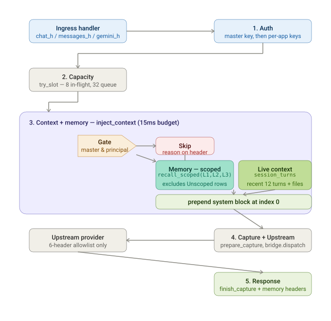
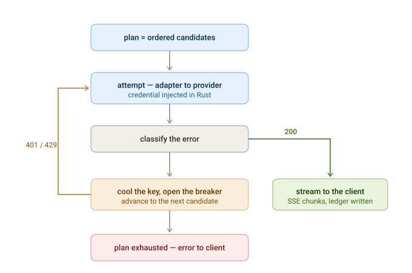
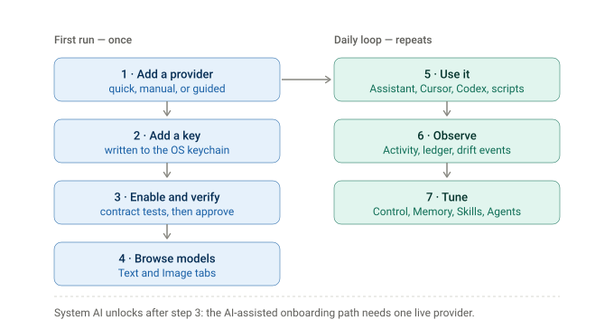

# 08 — Flows

Two flows. One is what happens to a **request**; the other is what a person **does**. They are worth reading
together, because most confusing behaviour is one of them being mistaken for the other.

## Application flow — one routed request

Five stages, and every one of them runs before the provider is contacted:

| Stage | What happens |
|---|---|
| 1 · Auth | Master key, then per-app keys. A `401` here is the healthy answer to a bad key |
| 2 · Capacity | `try_slot` — 8 in flight, 32 queued. Overflow is a `429`, not a stall |
| 3 · Context + memory | `inject_context` under a 15 ms budget. Scoped recall of L1–L3; a skip carries its reason on a header |
| 4 · Capture + upstream | `prepare_capture`, then `bridge.dispatch` into the router core, then the provider through a 6-header allowlist |
| 5 · Response | `finish_capture` plus memory headers |

**All four ingress dialects converge on one canonical chat body before dispatch.** That is why stage 3 has a
single implementation rather than four, and why memory injection is not dialect-specific.

### Inside stage 4 — the attempt loop

The single most misread part of the design: **rotation and failover are the same mechanism.** Each attempt on
the plan — the next key, or the next provider — *is* the retry. There is no separate hidden retry loop.

- A `401` or `429` **cools the key** rather than deprioritising it, and the planner **drops** cooled keys. So
  the earliest a client can be served is when the *first* cooled key frees up — which is why the client-facing
  `Retry-After` is the **shortest** named wait, not the longest.
- A whole plan is bounded at **6 attempts**.
- `5 drift-class errors within 15 minutes across 2 or more models`, while those models succeed elsewhere, is
  the drift signal that starts a repair — see [02](02-architecture.md).

### The other flows

| Flow | Diagram |
|---|---|
| System overview — layers, router, gateway, key-blind egress | [`../diagrams/architecture.html`](../../diagrams/architecture.html) |
| Master-key generation and endpoint URL setup | [`../diagrams/gateway.html`](../../diagrams/gateway.html) |
| Auto-onboarding a new provider (self-construction) | [`../diagrams/self-construction.html`](../../diagrams/self-construction.html) |
| Memory write path — capture, queue, distillation, L0–L3 | [`../diagrams/memory-context-gateway-write-path.svg`](../../diagrams/memory-context-gateway-write-path.svg) |

## User flow — first run, then the daily loop

### First run — once

| Step | You do | Under the hood |
|---|---|---|
| 1 · Add a provider | Quick add for known profiles (OpenRouter, OpenCode Zen, b.ai), Manual for any OpenAI- or Anthropic-compatible base URL, or Guided setup for anything else | Guided setup tries the **deterministic** path first: free probes, dialect fingerprinting against the builtin templates, OpenAPI discovery when a spec is served. The AI generator runs only if that fails, and it never sees a key or a raw response body |
| 2 · Add a key | One key per provider, entered on the Providers screen | The keychain write happens in Rust. The webview holds only a `secretRef`, and the one-shot reveal never enters webview-observable state |
| 3 · Enable and verify | Contract tests run against the provider with your key, then you approve | `pingKey`, then `listModels`, then a minimal text call. Paid calls require explicit consent with an estimated cost. The provider stays `pending` until you confirm, and the report is kept on its card |
| 4 · Browse models | Model Browser, Text and Image tabs, alias priority, per-capability defaults | Discovery goes through the adapter and is cached with a TTL. Entries are exposed as `provider-slug/native-id`; a bare ID resolves through the alias map. Nothing is an image model unless a manifest declares it |

**Step 3 is the milestone.** The AI-assisted onboarding path stays locked until one provider is live and
contract-tested — the bootstrap problem, resolved deterministically rather than by AI. OpenRouter and OpenCode
Zen are OpenAI-compatible, so the realistic first run needs no AI at all.

### Daily loop — repeats

| Step | You do | Under the hood |
|---|---|---|
| 5 · Use it | Chat and image generation in the Assistant, or point Cursor, Codex, a script or a chat UI at the local gateway | Both paths hit the same router with the same rotation and failover. The Assistant recalls **unscoped**; the gateway path recalls **scoped** and injects into the canonical body. Per-app gateway keys let you revoke one client without rotating the master key |
| 6 · Observe | Activity, History, and the drift events on a provider card | The ledger records tokens, cost, latency and error class per request, including `cached_tokens` where a provider reports it. `source` attribution separates UI, gateway and internal generator traffic |
| 7 · Tune | Control, Memory, Skills, Agents | Control is the switchboard for cross-cutting switches — one place, not a mirror per screen. Memory atoms are born unscoped and need a human to bind scope before scoped recall can return them |

### Two things that surprise people

**The gateway is not always available.** It bridges into the webview-hosted core, so if the app's window is
reloading, crashed or closed the gateway answers `503` immediately. It is a desktop app that serves HTTP, not a
service — see [02](02-architecture.md).

**Memory recall looks broken on the gateway path and is not.** Every atom is born unscoped, and scoped recall
excludes unscoped rows. Until a human binds scope, gateway recall legitimately returns nothing. Measured live
corpus when this was written: **0 scoped versus 14 unscoped**. The Assistant shows the 14, which makes the
gateway look broken by comparison.

## Next

[09 Status](09-status.md) — where the project actually stands today.
